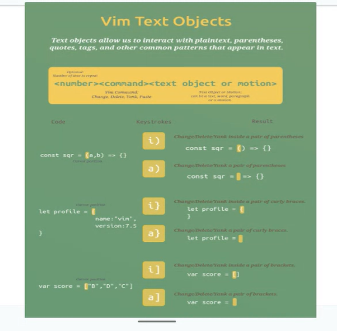
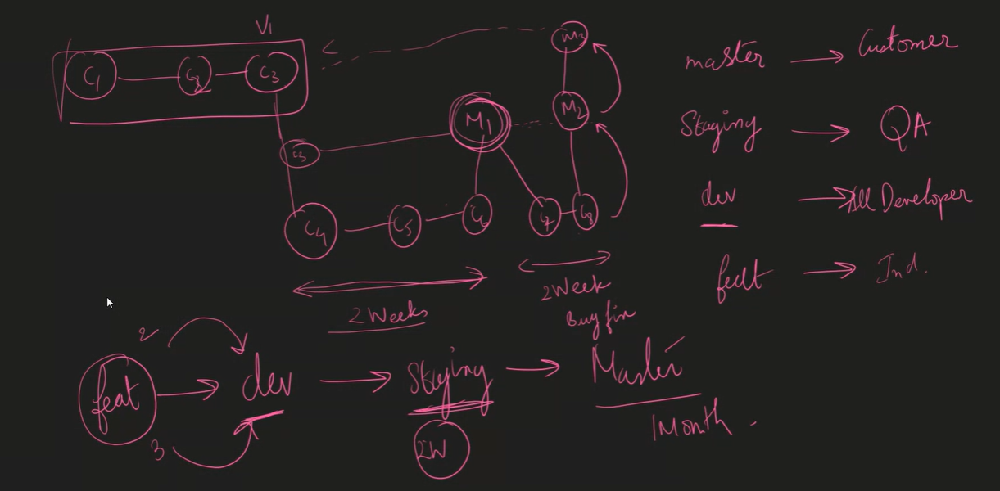
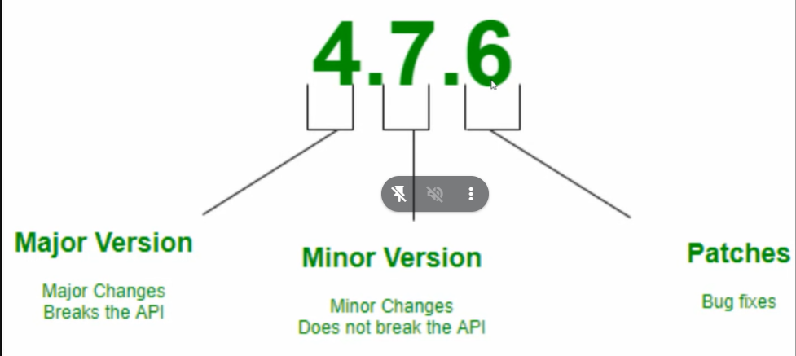

# GIT FUNDAMENTALS

>> ctrl + -> shoe/hide terminal  

$ git . --- adds all the files 
$ git commit -m "start of my git fundamentals" -----create the commit stmt
$ git status 
$ git log --- shows no of commits we have done and what time and msg was given 
shows updated commits first  
press q to quit when its stuck

$git checkout - (q)
 $ git checkout hashval -  (to get into the path of the perticular commit)    
 $ git checkout - (to back to the previous head pointing commit)    
 $ git checkout master  or $ git switch - (goes to master terminal/branch  )       

 # commands of git log  
 $ git log -1(shows the latest commit )    
 $ git log --author=shr(showes the author name ,it filters acc to the bit given )  
 $ git log --help(shows the commands )  
 $ git log --n (no of commits)  
 $ git log -p(shows the patch[code added or deleted]) changes done   
### -S-->pick-axe--SEARCH (to search regression bug ie wen it got over chnge)
 $ git log -Ssum   (Svaluto be searched)(search the perticular function in commits )  

 $ git log -Ssum -p ( space -- page down , /double--  the search gets highligted(in terminal it replaces the colon ) , n -- forwards to nxt match , N backwards towards the match , )  
  
githud -- place to store files in online.    
git---software     
gitlab--store files       

working--code part 
staging --- select perticular file to commit 
commit----
- logical change 
- small commits 
- multiple commits 
- code shld work" always commit wen everything is working"
message - it shld state why the changes r done (what made code run / bug is removed )  

> ### to unstage ---  $ git reset 

>### to delete the changes --- $ git checkout - .

>> ### to delete the commit  ---  $ git revert commitID

 >> vim ---editor  
 to enter ------$vim name of the file u want    
 to quit ------:wq  
 j-downwards   k-upwards L--right h--left ll

 >> verb + number +movement

# Git vs Git Hub
Git | Git Hub |
---| ----|
Its an actual s/w | Its a place to store files
Its the VCS | bitbucket, gitlab are similar to github
Its an offline s/w | It cannot work without internet
 
 
## Git Fundamentals
Pushing the code through command line
1. git init -> To initialize a repository
2. git add path -> To stage the changes
3. git status -> To check the file's current state
4. git commit -m "message" -> savepoint with a message
5. git log -> To Track the commits
To exit from git log press 'q'
6. git checkout hashvalue - to jump to particular commit
7. git checkout - --> it brings back to the previous head pointing commit
8. git switch - -> Switch to the master branch
8. git checkout master -> To bring back to recent commit  
9. git branch --a/--all --> to see all the branches.
9. git clone url ----to clone the git repository.
11. git pull --- pulls what all chnages done in online to offline
12. pit push --- pushes offline to online.
 
### Git Log
1. git log -> to see commits
2. git log -n -> n number of recent commits will be shown  
Filters
- --author==`<pattern>`
- -n `<n is number>`
3. git log -p -> patch (What code added or deleted), which lines modified in the files
4. git log -S -> pick-axe command
5. git log -S -p -> to track through the specific functions
    - `/<word>` - Highlight search
    - `<space>` - Page down
    - `n` - Next match
    - `N` - Prev match
### COMMIT
1. Why Commit is needed?
    - When there is logical change
2. Small Commits should made
3. Message should be proper
 
 
## VIM
Vim is an editor which will only open in git bash command line
- How to open vim?
> vim filename
- Shortcut in vim
> verb + number + movement
// VIM tutor & Vim games
### Different verbs in VIM
1. Move up - k
2. MOve down - j
3. Move left - h
4. Move right - l
5. Delete - d
    - Delete one word - d + 1 (Where you want to delete a word)
    - Delete multiple words - d + n (n words are deleted)
    - Delete a line - d + d
    - Delete a para - d + ip (inside para)
    - Delete a selected word - d + iw (inside word)
    - Delete characters till a particular char - d + char(ex:a,b,c)
6. Save - w
7. Exit - q
8. forcefully quit -q!
9. To repeat recent command - .
10. yank (copy)  
## Git Cheat Sheet  
https://docs.google.com/presentation/d/1Za5LTulMB0whRkrvOF2zbQWRdcPR02j8AlwgQQctQPQ/edit?usp=sharing

  

git branch dev (create branch )
#### types of merge 
- merge commit   (it automatically merges and commit a new branch )  
- fast merge (when there r no commits in staging or master where its getting merge )  

> GIT   
what-it is a software (version control system )
WHY--- saving data offline
how-copy 
who-  

ahead-------->commits which are not done in main or not available  
behind----> commits which are present in main not in branch 
  

Semantic version (sem ver)--->12.0.1

# Merging with github