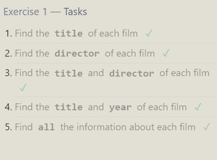
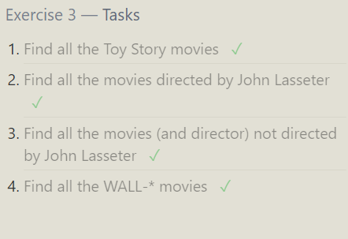
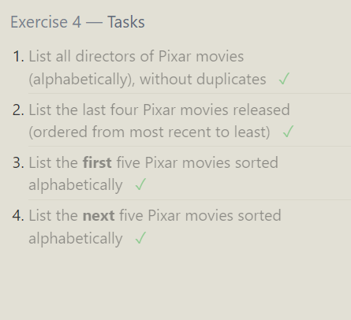
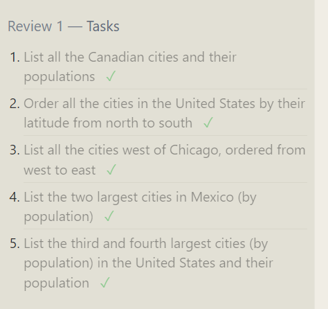

~~~sql
~~~
# ex-1

1.Find the title of each film  
~~~sql 
SELECT title FROM movies;    
~~~  
2.Find the director of each film
~~~sql
    SELECT director FROM movies;
~~~  
3.Find the title and director of each film   
~~~sql
    SELECT title,director FROM movies;
~~~
4.Find the title and year of each film   
~~~sql
    SELECT title,year FROM movies;
~~~
5.Find all the information about each film   
~~~sql
    SELECT * FROM movies;
~~~

# ex-2

1.Find the movie with a row id of 6   
~~~sql
    SELECT * FROM movies
    where id = 6;
~~~
2.Find the movies released in the years between 2000 and 2010  
~~~sql
    SELECT * FROM movies
    where year between 2000 and 2010;   
~~~
3.Find the movies not released in the years between 2000 and 2010  
~~~sql
    SELECT * FROM movies
    where year not between 2000 and 2010;
~~~
4.Find the first 5 Pixar movies and their release year  
~~~sql
    SELECT title,year FROM movies
     limit 5; // where year in (2001,2007,2010)
~~~
 

# ex-3
1.Find all the Toy Story movies  
~~~sql
    SELECT * FROM movies
    where title like "toy story%" ;
~~~
2.Find all the movies directed by John Lasseter  
~~~sql
    SELECT * FROM movies
    where director = "John Lasseter";
~~~
3.Find all the movies (and director) not directed by John Lasseter  
~~~sql
    SELECT * FROM movies
    where director != "John Lasseter";
~~~
4.Find all the WALL-* movies  
~~~sql
    SELECT * FROM movies
    where title like  "%WALL-%";
~~~
 
# EX-4 
1.List all directors of Pixar movies (alphabetically), without duplicates
~~~sql
    SELECT Distinct director FROM movies
    order by director;
~~~
2.List the last four Pixar movies released (ordered from most recent to least)
~~~sql
    SELECT * FROM movies
    where year order by year desc limit 4;
~~~
3.List the first five Pixar movies sorted alphabetically
~~~sql
    SELECT * FROM movies
    order by title asc limit 5;
~~~
4.List the next five Pixar movies sorted alphabetically
~~~sql
    SELECT * FROM movies
    order by title asc limit 5 offset 5;
~~~

# ex-5
1.List all the Canadian cities and their populations
~~~sql
    SELECT city, population  FROM north_american_cities
    where country like "canada";
~~~
2.Order all the cities in the United States by their latitude from north to south
~~~sql
    SELECT city FROM north_american_cities
    where country like "united states" order by latitude desc;
~~~
3.List all the cities west of Chicago, ordered from west to east
~~~sql
SELECT * FROM north_american_cities
where longitude < (select longitude FROM north_american_cities 
where city = "Chicago") order by longitude;
~~~
4.List the two largest cities in Mexico (by population)
~~~sql
    SELECT * FROM north_american_cities
    where country = "Mexico" order by population desc limit 2;
~~~
5.List the third and fourth largest cities (by population) in the United States and their population
~~~sql
    SELECT * FROM north_american_cities
    where country = "United States" order by population desc limit 2 offset 2;
~~~
