~~~sql
~~~
# ex-1

1.Find the title of each film  
~~~sql 
SELECT title FROM movies;    
~~~  
2.Find the director of each film
~~~sql
    SELECT director FROM movies;
~~~  
3.Find the title and director of each film   
~~~sql
    SELECT title,director FROM movies;
~~~
4.Find the title and year of each film   
~~~sql
    SELECT title,year FROM movies;
~~~
5.Find all the information about each film   
~~~sql
    SELECT * FROM movies;
~~~

# ex-2

1.Find the movie with a row id of 6   
~~~sql
    SELECT * FROM movies
    where id = 6;
~~~
2.Find the movies released in the years between 2000 and 2010  
~~~sql
    SELECT * FROM movies
    where year between 2000 and 2010;   
~~~
3.Find the movies not released in the years between 2000 and 2010  
~~~sql
    SELECT * FROM movies
    where year not between 2000 and 2010;
~~~
4.Find the first 5 Pixar movies and their release year  
~~~sql
    SELECT title,year FROM movies
     limit 5; // where year in (2001,2007,2010)
~~~
 

# ex-3
1.Find all the Toy Story movies  
~~~sql
    SELECT * FROM movies
    where title like "toy story%" ;
~~~
2.Find all the movies directed by John Lasseter  
~~~sql
    SELECT * FROM movies
    where director = "John Lasseter";
~~~
3.Find all the movies (and director) not directed by John Lasseter  
~~~sql
    SELECT * FROM movies
    where director != "John Lasseter";
~~~
4.Find all the WALL-* movies  
~~~sql
    SELECT * FROM movies
    where title like  "%WALL-%";
~~~
 
# EX-4 
1.List all directors of Pixar movies (alphabetically), without duplicates
~~~sql
    SELECT Distinct director FROM movies
    order by director;
~~~
2.List the last four Pixar movies released (ordered from most recent to least)
~~~sql
    SELECT * FROM movies
    where year order by year desc limit 4;
~~~
3.List the first five Pixar movies sorted alphabetically
~~~sql
    SELECT * FROM movies
    order by title asc limit 5;
~~~
4.List the next five Pixar movies sorted alphabetically
~~~sql
    SELECT * FROM movies
    order by title asc limit 5 offset 5;
~~~

# ex-5
1.List all the Canadian cities and their populations
~~~sql
    SELECT city, population  FROM north_american_cities
    where country like "canada";//=
~~~
2.Order all the cities in the United States by their latitude from north to south
~~~sql
    SELECT city FROM north_american_cities
    where country like "united states" order by latitude desc;
~~~
3.List all the cities west of Chicago, ordered from west to east
~~~sql
SELECT * FROM north_american_cities
where longitude < (select longitude FROM north_american_cities 
where city = "Chicago") order by longitude;
~~~
~~~sql
SELECT * FROM north_american_cities
where longitude < -87.629798
order by longitude;
~~~
4.List the two largest cities in Mexico (by population)
~~~sql
    SELECT * FROM north_american_cities
    where country = "Mexico" order by population desc limit 2;
~~~
5.List the third and fourth largest cities (by population) in the United States and their population
~~~sql
    SELECT * FROM north_american_cities
    where country = "United States" order by population desc limit 2 offset 2;
~~~

# EX-6 
1.Find the domestic and international sales for each movie
~~~sql
    SELECT title,Domestic_sales,International_sales FROM Movies 
    INNER JOIN Boxoffice on Movies.Id = Boxoffice.Movie_id ;
~~~
2.Show the sales numbers for each movie that did better internationally rather than domestically
~~~sql
    SELECT title,	Domestic_sales, International_sales FROM movies as mv
    INNER JOIN Boxoffice as bo on mv.Id = bo.Movie_id
    where  International_sales > Domestic_sales
;
~~~
3.List all the movies by their ratings in descending order
~~~sql
    SELECT title,rating FROM movies as mv
    INNER JOIN Boxoffice as bo on mv.Id = bo.Movie_id
    order by rating desc;
~~~
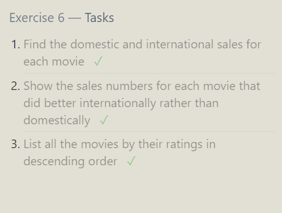
# EX-7
1.Find the list of all buildings that have employees
~~~sql
    SELECT distinct building FROM employees
    join buildings on employees.building = buildings.building_name;
~~~
~~~sql
    SELECT distinct building FROM employees
~~~~
2.Find the list of all buildings and their capacity
~~~sql
    SELECT building_name,capacity FROM buildings;
~~~
3.List all buildings and the distinct employee roles in each building (including empty buildings)
~~~sql
    SELECT distinct role , building_name FROM buildings
    left join employees on buildings.building_name = employees.building;
~~~

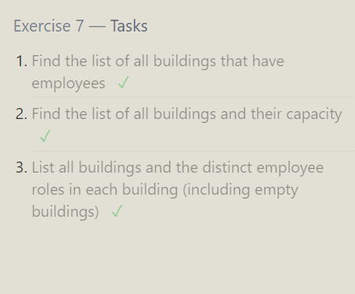
# ex-8
1.Find the name and role of all employees who have not been assigned to a building
~~~sql
    SELECT role , name FROM employees
    where building is null;
~~~

2.Find the names of the buildings that hold no employees
~~~sql
    SELECT building_name  FROM buildings
    left join employees on buildings.building_name = employees.building
    where building is null;
~~~
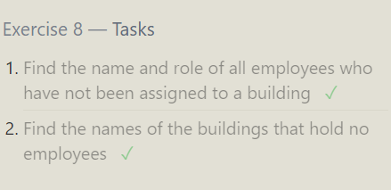
#  ex-9
1.List all movies and their combined sales in millions of dollars
~~~sql
    SELECT title ,(Domestic_sales+International_sales)/1000000 
    as combined_sale FROM movies
    join Boxoffice on Id = Movie_id;
~~~
2.List all movies and their ratings in percent
~~~sql
    SELECT title, (rating)*10 FROM movies
    join Boxoffice on Id = Movie_id;
~~~
3.List all movies that were released on even number years
~~~sql
    SELECT title, (year) FROM movies
    where year%2==0 ;
~~~
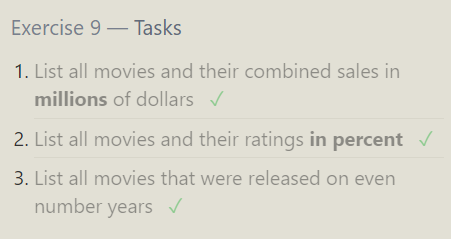
# ex-10
1.Find the longest time that an employee has been at the studio
~~~sql
SELECT max(	Years_employed)	 FROM employees;
~~~
2.For each role, find the average number of years employed by employees in that role
~~~sql
    SELECT role ,avg(Years_employed) FROM employees
    group by role;
~~~
3.Find the total number of employee years worked in each building
~~~sql
    SELECT building ,sum(Years_employed) FROM employees
    group by building;
~~~
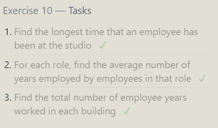
# EX-11
1.Find the number of Artists in the studio (without a HAVING clause)
~~~sql
    SELECT count(role) FROM employees 
    where role like ("%Artist%")
    group by role ;
~~~
2.Find the number of Employees of each role in the studio
~~~sql
    SELECT count(name) ,role FROM employees 
    group by role ;
~~~
3.Find the total number of years employed by all Engineers
~~~sql
    SELECT sum(	Years_employed), role FROM employees
    where role like ("%Engineer")
    group by role;
~~~
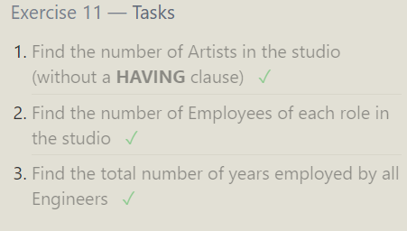

# EX-12
1.Find the number of movies each director has directed
~~~sql
    SELECT count(Title) ,Director FROM movies
    group by director;
~~~
2.Find the total domestic and international sales that can be attributed to each director
~~~sql
    SELECT sum(Domestic_sales+International_sales) as total ,Director 
    FROM movies
    join Boxoffice on id = Movie_id
    group by director;
~~~
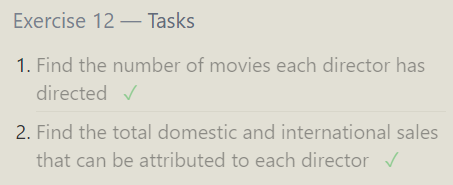

# EX-13
1.Add the studio's new production, Toy Story 4 to the list of movies (you can use any director)
~~~sql
    insert into movies values (4,"	Toy Story 4","	John Lasseter",	2000,95);
~~~
2.Toy Story 4 has been released to critical acclaim! It had a rating of 8.7, and made 340 million domestically and 270 million internationally. Add the record to the BoxOffice table.
~~~sql
    insert into Boxoffice values(4 ,8.7,340000000,270000000);
~~~
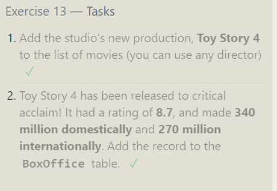
# Ex-14
1.The director for A Bug's Life is incorrect, it was actually directed by John Lasseter
~~~sql
update movies set director =  "John Lasseter" where id = 2 ;
~~~
2.The year that Toy Story 2 was released is incorrect, it was actually released in 1999
~~~sql
update movies set year = 1999 where id = 3 ;
~~~
3.Both the title and director for Toy Story 8 is incorrect! The title should be "Toy Story 3" and it was directed by Lee Unkrich
~~~sql
    update movies set title ="Toy Story 3" ,director ="Lee Unkrich"  where id = 11 ;
~~~
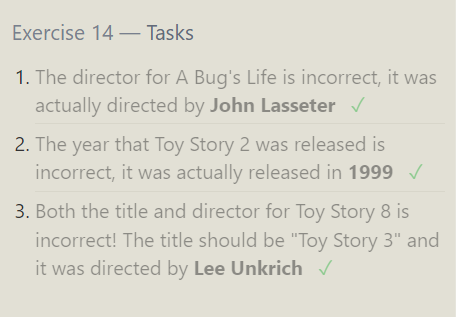
# ex-15
1.This database is getting too big, lets remove all movies that were released before 2005. 
~~~sql
delete  FROM movies where year <2005 ;
~~~
2.Andrew Stanton has also left the studio, so please remove all movies directed by him.
~~~sql
delete from movies where director = "Andrew Stanton";
~~~
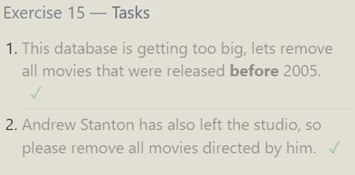
# ex - 16
1.Create a new table named Database with the following columns:
– Name A string (text) describing the name of the database
– Version A number (floating point) of the latest version of this database
– Download_count An integer count of the number of times this database was downloaded
This table has no constraints.
~~~sql
    create table Database (Name varchar, Version float, Download_count int );

~~~
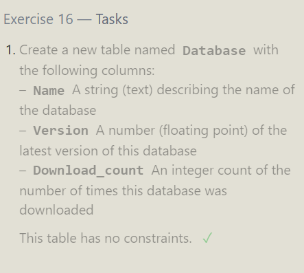
# ex-17
Add a column named Aspect_ratio with a FLOAT data type to store the aspect-ratio each movie was released in.
~~~sql
alter table  Movies add Aspect_ratio float;
~~~
Add another column named Language with a TEXT data type to store the language that the movie was released in. Ensure that the default for this language is English.
~~~sql
alter table  Movies add Language varchar default english;
~~~
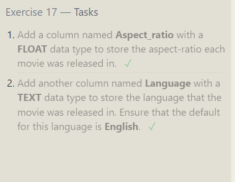
# ex-18
1. We've sadly reached the end of our lessons, lets clean up by removing the Movies table
~~~sql
DROP TABLE IF EXISTS Movies;
~~~
2.And drop the BoxOffice table as well
~~~sql
drop table boxoffice;
~~~
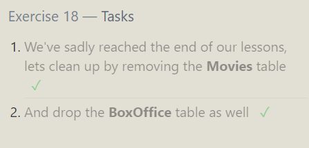

# QUERIES 
CREATE TABLE salesman (
    salesman_id INT PRIMARY KEY,
    name VARCHAR(255),
    city VARCHAR(255),
    commission DECIMAL(4, 2)
);

Select * from salesman

INSERT INTO salesman (salesman_id, name, city, commission) VALUES(5001, 'James Hoog', 'New York', 0.15),
(5002, 'Nail Knite', 'Paris', 0.13),
(5005, 'Pit Alex', 'London', 0.11),
(5006, 'Mc Lyon', 'Paris', 0.14),
(5003, 'Lauson Hen', NULL, 0.12),
(5007, 'Paul Adam', 'Rome', 0.13);  
 # TASK1
-- Find the average commision of a saleman from Paris
~~~SQL
select avg(commission) as avg, city from salesman 
group by city 
having city like 'Paris'
;
~~~
# TASK2
--Find out if there are cities with only one salesman and list them | No nulls Clue: Having
~~~SQL
select city from salesman 
group by city having count(city) = 1;
~~~  
 CREATE TABLE orders (
    ord_no INT PRIMARY KEY,
    purch_amt DECIMAL(10, 2),
    ord_date DATE,
    customer_id INT,
    salesman_id INT
);

INSERT INTO orders (ord_no, purch_amt, ord_date, customer_id, salesman_id) VALUES
(70001, 150.5, '2012-10-05', 3005, 5002),
(70009, 270.65, '2012-09-10', 3001, 5005),
(70002, 65.26, '2012-10-05', 3002, 5001),
(70004, 110.5, '2012-08-17', 3009, 5003),
(70007, 948.5, '2012-09-10', 3005, 5002),
(70005, 2400.6, '2012-07-27', 3007, 5001),
(70008, 5760, '2012-09-10', 3002, 5001),
(70010, 1983.43, '2012-10-10', 3004, 5006),
(70003, 2480.4, '2012-10-10', 3009, 5003),
(70012, 250.45, '2012-06-27', 3008, 5002),
(70011, 75.29, '2012-08-17', 3003, 5007),
(70013, 3045.6, '2012-04-25', 3002, 5001);
Select * from salesman
Select * from orders;
# Task 3 - Sub-Query
-- Write a query to display all the orders from the orders table issued by the salesman 'Paul Adam'.
--SELECT salesman_id from salesman 
--where name = 'Paul Adam';
~~~sql
select * from orders where salesman_id = (SELECT salesman_id from salesman 
where name = 'Paul Adam'
);  
~~~

# Task 4
-- Write a query to display all the orders which values are greater than the average order value for 10th October 2012
~~~sql
select * from orders 
where (purch_amt) > (select avg(purch_amt)from orders  where ord_date ='2012-10-10')
;
~~~
# Task 6
-- Write a query to find all orders attributed to a salesman in 'Paris'
-- Clue: In operator
~~~sql
select * from orders
where salesman_id in (select salesman_id from salesman where city = 'paris');
~~~

CREATE TABLE customer (
    customer_id INT PRIMARY KEY,
    cust_name VARCHAR(255),
    city VARCHAR(255),
    grade INT NULL,
    salesman_id INT
);
INSERT INTO customer (customer_id, cust_name, city, grade, salesman_id) VALUES
(3002, 'Nick Rimando', 'New York', 100, 5001),
(3005, 'Graham Zusi', 'California', 200, 5002),
(3001, 'Brad Guzan', 'London', NULL, 5005),
(3004, 'Fabian Johns', 'Paris', 300, 5006),
(3007, 'Brad Davis', 'New York', 200, 5001),
(3009, 'Geoff Camero', 'Berlin', 100, 5003),
(3008, 'Julian Green', 'London', 300, 5002),
(3003, 'Jozy Altidor', 'Moscow', 200, 5007);

#  Task 7
-- Write a query to find the name and id of all salesmen who had more than one customer
~~~sql
    select salesman_id ,name from salesman 
    where salesman_id in  (select salesman_id  from customer
    group by salesman_id 
    having count(salesman_id ) > 1);
~~~
# STRING FUNCTIONS
~~~SQL
--string functions
--1.len
select len('shreya') as namecount ; 
--2.left
select left('shreya',4) as namecount ;
--3.right
select RIGHT('shreya',2) as namecount ;
--4.Substring
select substring('shreya',3,3) as namecount ;
--5.upper
select upper('shreya') as namecount ;
--6.lower
select lower('SHREYA') as namecount ;
--7.ltrim
select ltrim('       shreya') as namecount ;--- byspaces 
select ltrim('19shreya',19) as namecount ;----remove pattern
select ltrim('       shreya',2) as namecount ;---space val
--8.rtrim
select rtrim('  shreya     ') as a  ;

--9.charindex--search
select charindex('hr','shreya') as namecount ;
select charindex('a','shreya' , 3) as namecount ;
--10.replace
select replace('shreya','ya','ee') as namecount ;
--11.concat
select concat('shreya',' ','p') as namecount ;
--12.replicate-repeat
select replicate('shreya ',3) as namecount ;
--13. reverse
select reverse('shreya') as namecount ; 

--MATHEMATICAL FUNC
--1. abs +ve
select abs(-5)
--power
select power(2,4)
--3.round
select round(58.345 , 2)
--4. ceiling--rounds to highest val
select ceiling(58.768)
--5.floor
select floor(58.976)

---DATE FUNCTIONS 
--1.getdate
select getdate() 
--2.dateadd-- add no of dates or months 
select dateadd(month,3, getdate() )
--3.datediff
select datediff(day,'01-01-2024', getdate() )
--4.format
select format( getdate(), 'dd MMMM yyyy' )
select format( getdate(), 'dd MMM yyyy' )
--5.datePart--extract the perticular part from the date .
select datepart(month, getdate() )
~~~

