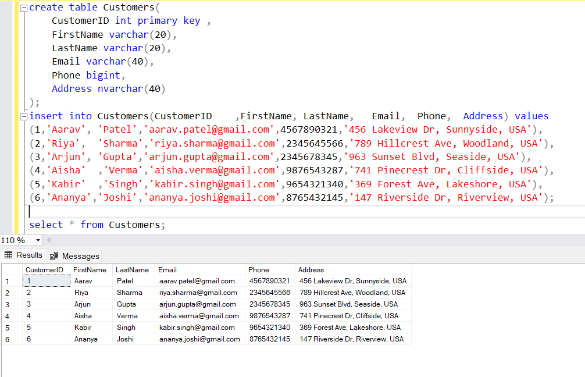

### SQL Assessment 

**Assessment Overview:**
This assessment is designed to evaluate your proficiency in SQL through practical tasks encompassing data manipulation, query formulation, and complex joins and subqueries. The questions are based on a fictional company named "TechShop," which sells electronic gadgets. TechShop maintains data related to their products, customers, and orders. Ensure to create your own data for testing your queries.

**Database Tables:**

1. **Customers:**

   - `CustomerID` (Primary Key)
   - `FirstName`
   - `LastName`
   - `Email`
   - `Phone`
   - `Address`
~~~sql
create table Customers
(CustomerID int primary key ,
    FirstName varchar(20),
    LastName varchar(20),
    Email varchar(40),	
    Phone bigint,	
    Address nvarchar(40)
);
insert into Customers(CustomerID	,FirstName,	LastName,	Email,	Phone,	Address) values 
(1,'Aarav',	'Patel','aarav.patel@ex.com',4567890321,'456 Lakeview Dr, Sunnyside, USA'),
(2,'Riya',	'Sharma','riya.sharma@example.com',2345645566,'789 Hillcrest Ave, Woodland, USA'),
(3,'Arjun',	'Gupta',	'arjun.gupta@example.com',2345678345,'963 Sunset Blvd, Seaside, USA'),
(4,'Aisha'	,'Verma',	'aisha.verma@example.com',9876543287,'741 Pinecrest Dr, Cliffside, USA'),
(5,'Kabir'	,'Singh'	,'kabir.singh@example.com',9654321340,'369 Forest Ave, Lakeshore, USA'),
(6,'Ananya','Joshi',	'ananya.joshi@example.com',8765432145,'147 Riverside Dr, Riverview, USA');
~~~

2. **Products:**

   - `ProductID` (Primary Key)
   - `ProductName`
   - `Description`
   - `Price`
~~~sql
CREATE TABLE Products (
    ProductID INT PRIMARY KEY,
    ProductName VARCHAR(100),
    Description TEXT,
    Price DECIMAL(10, 2)
);
insert into products(ProductID,	ProductName,	Description,	Price) values
(101,'Laptop','High performance laptop',1200.00),
(102,'Smartphone','Latest model smartphone',800.00),
(103,'Headphones','Noise-canceling headphones',150.00),
(104,'Tablet','Tablet with stylus',500.00),
(105,'Smart Watch','Fitness and health tracker',300.00),
(106,'Wireless Earbuds','Bluetooth wireless earbuds',100.00);
~~~

3. **Orders:**

   - `OrderID` (Primary Key)
   - `CustomerID` (Foreign Key referencing Customers)
   - `OrderDate`
   - `TotalAmount`
~~~sql
CREATE TABLE Orders (
    OrderID INT PRIMARY KEY,
    CustomerID INT,
    OrderDate DATETIME,
    TotalAmount DECIMAL(10, 2),
    FOREIGN KEY (CustomerID) REFERENCES Customers(CustomerID)
);

insert into orders(OrderID	,CustomerID	,OrderDate,	TotalAmount) values
(201,	1,	'2024-06-01 10:30:00',	2050.00),
(202,	2,	'2024-06-02 11:45:00',	950.00),
(203,	3,	'2024-06-03 09:00:00',	650.00),
(204,	4,	'2024-06-04 14:00:00',	400.00),
(205,	5,	'2024-06-05 05:30:00',	2070.00),
(206,	6,	'2024-06-06 08:45:00',	950.00);
~~~

4. **OrderDetails:**

   - `OrderDetailID` (Primary Key)
   - `OrderID` (Foreign Key referencing Orders)
   - `ProductID` (Foreign Key referencing Products)
   - `Quantity`
~~~sql
CREATE TABLE OrderDetails (
    OrderDetailID INT PRIMARY KEY,
    OrderID INT,
    ProductID INT,
    Quantity INT,
    FOREIGN KEY (OrderID) REFERENCES Orders(OrderID),
    FOREIGN KEY (ProductID) REFERENCES Products(ProductID)
);

insert into OrderDetails(OrderDetailID,	OrderID,	ProductID,	Quantity) values
(301	,201	,101	,1),
(302	,201	,103	,2),
(303	,202	,102	,1),
(304	,203	,104	,1),
(305	,203	,105	,1),
(306	,204	,103	,2);
~~~

5. **Inventory:**
   - `InventoryID` (Primary Key)
   - `ProductID` (Foreign Key referencing Products)
   - `QuantityInStock`
   - `LastStockUpdate`
~~~sql
CREATE TABLE Inventory (
    InventoryID INT PRIMARY KEY,
    ProductID INT,
    QuantityInStock INT,
    LastStockUpdate DATETIME,
    FOREIGN KEY (ProductID) REFERENCES Products(ProductID)
);
insert into Inventory(InventoryID	,ProductID,	QuantityInStock,	LastStockUpdate) values
(401,	101,15,	'2024-06-01 08:00:00'),
(402,	102,20,	'2024-06-01 09:30:00'),
(403,	103,30,	'2024-06-01 07:45:00'),
(404,	104,10,	'2024-06-01 10:00:00'),
(405,	105,25,	'2024-06-01 11:15:00'),
(406,	106,15,	'2024-06-01 12:00:00');
~~~

**Questions:**

1. Write an SQL query to retrieve the names and emails of all customers.
~~~sql
    select concat(FirstName,' ',LastName) as name,email     from Customers;
~~~

2. Write an SQL query to list all orders with their order dates and corresponding customer names.
~~~sql
    select concat(FirstName,' ',LastName) as name ,OrderDate 
    from Customers as c
    join orders as o on c.CustomerID = o.CustomerID;
~~~

3. Write an SQL query to insert a new customer record into the "Customers" table. Include customer information such as name, email, and address.
~~~sql
    insert into Customers(CustomerID	,FirstName,	LastName,	Email,	Phone,	Address) values 
    (7,'Akash',	'jupally','akash.jupally@example.com',7670805050,'789 Oak St, Anycity, USA');
    select * from Customers;
~~~

4. Write an SQL query to update the prices of all electronic gadgets in the "Products" table by increasing them by 10%.
~~~sql
    update Products set price = price * 1.1;
    select price 
    from Products;
~~~

5. Write an SQL query to delete a specific order and its associated order details from the "Orders" and "OrderDetails" tables. Allow users to input the order ID as a parameter.
~~~sql
    declare @ip int
    set @ip = 202
    delete from Orders
    where OrderID = @ip;
    delete from OrderDetails
    where OrderID = @ip;
    select * from Orders;
    select * from OrderDetails;
~~~

6. Write an SQL query to insert a new order into the "Orders" table. Include the customer ID, order date, and any other necessary information.
~~~sql
    insert into orders(OrderID	,CustomerID	,OrderDate,	TotalAmount) values
    (207,	7,	'2024-06-08 06:30:00',	1150.00);
    select * from orders;
~~~

7. Write an SQL query to update the contact information (e.g., email and address) of a specific customer in the "Customers" table. Allow users to input the customer ID and new contact information.
~~~sql
    select * from Customers;
    update Customers set email = 'aarav.p@gmail.com' , address = '19 Lakeview Dr, USA'
    where CustomerID = 1 ;
    select * from Customers;
~~~

8. Write an SQL query to recalculate and update the total cost of each order in the "Orders" table based on the prices and quantities in the "OrderDetails" table.
~~~sql
    UPDATE Orders 
    SET  Orders.TotalAmount = test.new 
    from Orders
    inner join (
        SELECT od.OrderID,SUM(p.Price * od.Quantity) as new
        FROM OrderDetails od
        join products as p on od.ProductID = p.ProductID
        join orders as o on o.OrderID = od.orderID
        WHERE od.ProductID = p.ProductID
        group by od.OrderID) 
        as test on Orders.OrderID = test.OrderID 

    select * from Orders
~~~

9. Write an SQL query to delete all orders and their associated order details for a specific customer from the "Orders" and "OrderDetails" tables. Allow users to input the customer ID as a parameter.
~~~sql
declare @ipp int
set @ipp = 201
delete from Orders
where OrderID = @ipp;
delete from OrderDetails
where OrderID = @ipp;
select * from orders;
select * from OrderDetails;
~~~

10. Write an SQL query to insert a new electronic gadget product into the "Products" table, including product name, category, price, and any other relevant details.
~~~sql
    insert into products(ProductID,	ProductName,	Description,	Price) values
    (107,'Smart Ring','In-built sensor tracks wellness',3200.00);
    select* from Products;
~~~

11. Write an SQL query to update the status of a specific order in the "Orders" table (e.g., from "Pending" to "Shipped"). Allow users to input the order ID and the new status.
~~~sql
    update orders set status = 'shipped'
    where OrderID=201;
    select * from Orders;
~~~

12. Write an SQL query to calculate and update the number of orders placed by each customer in the "Customers" table based on the data in the "Orders" table.
~~~sql
INSERT INTO Orders VALUES
(207, 4, '2024-06-14 00:00:00.000', 1620.00,'shipped'),
(208, 4, '2024-07-14 00:00:00.000', 1200.00,'shipped'),
(209, 2, '2024-07-24 00:00:00.000', 1200.00,'shipped');

alter table customers add Count_of_Orders int default 0 ;

update Customers
set Customers.Count_of_Orders=new.No_Of_Orders 
from Customers c
JOIN (select CustomerID,count(OrderID) as No_Of_Orders 
	  from Orders 
	  group by CustomerID) as new
	  ON c.CustomerID = new.CustomerID
	  select * from customers;

~~~

13. Write an SQL query to retrieve a list of all orders along with customer information (e.g., customer name) for each order.
~~~sql
    select * from  Orders as o 
    left join Customers as c on c.CustomerID =o.CustomerID;
~~~

14. Write an SQL query to find the total revenue generated by each electronic gadget product. Include the product name and the total revenue.
~~~sql
    select ProductName,sum(p.price*od.Quantity) as total_revenue 
    from Products as p
    join  OrderDetails as od on  p.ProductID = od.ProductID
    group by ProductName
    ;
~~~

15. Write an SQL query to list all customers who have made at least one purchase. Include their names and contact information.
~~~sql
    select distinct c.CustomerID, OrderID,concat(FirstName,'	',LastName) as name,Email,Phone,Address  from Customers as c
    join orders as o on c.CustomerID = o.CustomerID
~~~

